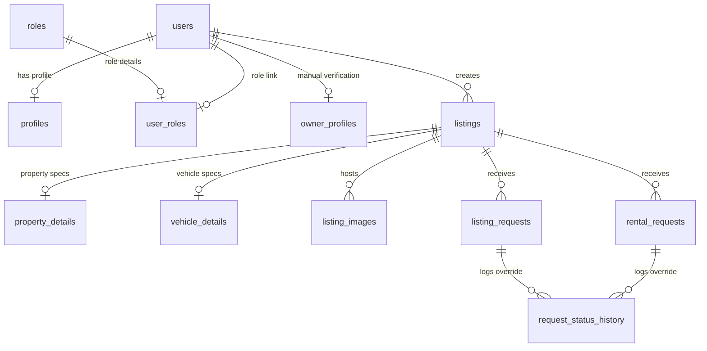

# System Architecture & Database Blueprint

This document details the software architecture, folder schemas, database schema models, Role-Based Access Controls (RBAC), and deployment infrastructure configurations for **MyEthioProperties**.

---

## 1. Directory & Codebase Structure

The MyEthioProperties application is built on **Next.js** (App Router) combined with **TypeScript**, **Tailwind CSS**, and **Supabase (PostgreSQL)**.

```
/src
├── app
│   ├── (auth)                     # Authentication routes (login, signup)
│   ├── (public)                   # Public marketplace routing
│   │   ├── properties             # Property search, category feeds, details pages
│   │   ├── cars                   # Car rental and sales search & details pages
│   │   ├── about, contact, terms  # Core legal and corporate static routes
│   │   ├── sitemap.ts, robots.ts  # Dynamic SEO generation engines
│   │   └── layout.tsx             # Public shell containing responsive header/footer
│   ├── admin                      # Moderation dashboard (listing review & inquiries)
│   └── dashboard                  # User portals (Become Owner, Renter, & Owner dashboards)
├── components
│   ├── layout                     # Layout headers, footers, & mobile menus
│   └── ui                         # Premium UI elements (buttons, inputs, glassmorphic cards)
└── lib
    ├── analytics.ts               # Secure SHA-256 IP + UA hashing analytics tracker
    ├── env                        # Zod schemas parsing client & private server variables
    ├── notifications.ts           # EscapeHtml sanitized twilio and resend REST mailer
    └── supabase                   # Supabase clients (anonymous client & RLS-bypassing admin client)
```

---

## 2. PostgreSQL Relational Database Schema

Below is the structured representation of all tables, fields, and connections inside the production Supabase instance.

### 2.1 Schema ER Diagram Mapping



---

### 2.2 Table Catalogs & Data Dictionaries

#### 1. `public.profiles`
Links to auth users, storing standard metadata. Role column dropped in favor of RBAC table linking.
*   `user_id` (`uuid`, Primary Key) -> references `auth.users(id)`
*   `email` (`text`, unique)
*   `full_name` (`text`)

#### 2. `public.roles` & `public.user_roles`
Scalable Role-Based Access Control (RBAC) linking tables:
*   **Base Roles**: `'renter'`, `'owner'`, `'admin'`.
*   **user_roles**: Links `user_id` (`uuid`) and `role_id` (`uuid`) with a unique constraint.

#### 3. `public.owner_profiles`
Maintains verified states for marketplace owners.
*   `id` (`uuid`, Primary Key)
*   `user_id` (`uuid`) -> unique reference to `auth.users(id)`
*   `owner_type` (`enum`: `'individual'`, `'rental_company'`, `'dealer'`)
*   `verification_status` (`enum`: `'not_submitted'`, `'pending'`, `'verified'`, `'rejected'`, `'suspended'`)
*   `business_name`, `admin_notes` (`text`)

#### 4. `public.listings`
Central registry mapping both vehicle and property listings.
*   `id` (`uuid`, Primary Key)
*   `owner_id` (`uuid`) -> references `auth.users(id)`
*   `category` (`enum`: `'vehicle'`, `'property'`)
*   `listing_type` (`enum`: `'rent'`, `'sale'`)
*   `title` (`text`), `description` (`text`), `location` (`text`)
*   `status` (`enum`: `'draft'`, `'pending_review'`, `'published'`, `'rejected'`, `'archived'`, `'suspended'`)
*   `admin_notes` (`text`) -> complete JSON checklist audit logs
*   `is_featured` (`boolean`)

#### 5. `public.property_details`
Extends property listings with specific dimensions and utility attributes.
*   `listing_id` (`uuid`, Primary Key) -> references `public.listings(id)`
*   `property_type_id` (`uuid`) -> references `public.property_types(id)`
*   `bedrooms` / `bathrooms` / `floor` / `total_floors` (`integer`)
*   `area_sqm` (`integer`)
*   `furnished_status` (`enum`: `'unfurnished'`, `'semi_furnished'`, `'fully_furnished'`)
*   `property_condition` (`enum`: `'newly_built'`, `'excellent'`, `'good'`, `'fair'`, `'needs_repair'`)
*   `parking_available` / `compound_available` / `water_available` / `electricity_available` / `internet_available` (`boolean`)

#### 6. `public.listing_images`
Links uploaded assets to private CDN tokens.
*   `id` (`uuid`, Primary Key)
*   `listing_id` (`uuid`) -> references `public.listings(id)`
*   `image_url` (`text`)
*   `display_order` (`integer`)

#### 7. `public.rental_requests` & `public.listing_requests`
Manages marketplace inquiries for rental agreements and direct purchase requests.
*   **Access Lock**: Inquiries default to `new_request` status. Only visible to owners *after* admin audit approvals transition status to `approved`.

#### 8. `public.request_status_history`
Granular administrative override logging for auditing status updates.

---

## 3. Core Architecture Conventions & Security

### 3.1 Row-Level Security (RLS) & Access Rules
Every data layer strictly enforces RLS policies. Renter, Owner, and Guest paths can only read or write rows that belong to them or are marked public:
*   **Public Catalog**: SELECT is permitted only if `status = 'published'` on listings and associated buckets.
*   **CDN Protection (`listing-images` bucket)**: Policies only grant public read permissions to images associated with active, published listing IDs. Unreleased drafts are secure and locked.
*   **RLS Bypassing Admin Engine**: All administrative triggers (approving listings, status overrides) bypass client-side checks by calling custom backend modules utilizing `SUPABASE_SERVICE_ROLE_KEY`.

### 3.2 Automated Admin Alert Pipeline
The platform includes an automated alert dispatcher triggered whenever rental or sale inquiries are created.
*   **XSS Sanitization**: Inputs are fully sanitized prior to HTML formatting using a customized, zero-dependency escaper.
*   **Resend REST Fetcher**: Dispatches alert emails directly to `ADMIN_NOTIFICATION_EMAIL` using Resend API integration.
*   **Twilio REST SMS**: Uses URL-encoded basic authentication to send alerts to the administrator's mobile device via Twilio SMS API.
*   **Obvious Production Fail-Safes**: Zod schemas validate keys during production startup. If credentials are missing at runtime in production, screaming error alerts logging critical warning payloads are printed, preventing silently degraded silent failures while allowing transactions to succeed.

### 3.3 GDPR-Compliant secure IP views tracking
*   IPs and browser User-Agents are securely anonymized into a 32-character SHA-256 string hashed with `ANALYTICS_SALT` before storing views.
*   Safe checks fall back without recording analytics in production if `ANALYTICS_SALT` is missing, preventing raw, unsalted viewer storage.
